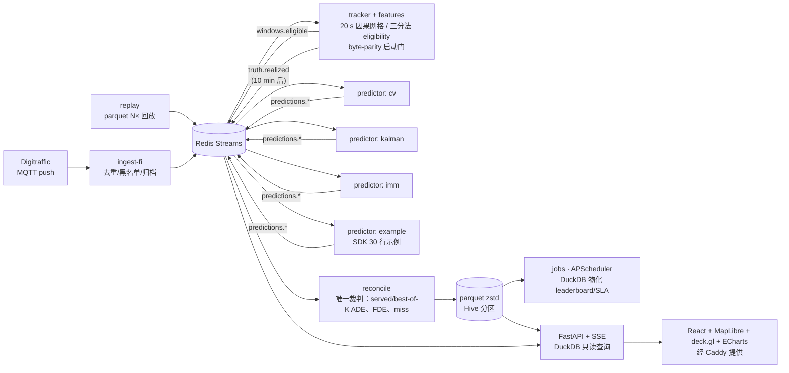

# AIS_streaming_testing_platform · EnvShip 在线预测平台 Demo

按 [`docs/roadmap.md`](docs/roadmap.md)（AIS 在线预测平台 · 技术路线图）**推荐的技术路线**实现的可运行竖切片（vertical slice）：
共享 AIS 流管道 → 预测器以插件容器 shadow 并行 → reconcile 在真值到达后统一打分 → live leaderboard + 地图界面 + 带真值的 parquet 数据集。

仓库自带 **约 40 分钟真实芬兰 AIS 数据（723 艘船、8.3 万条位置报文）**（Digitraffic，CC BY 4.0）作为 replay fixture，默认 20× 回放，**启动后约 1 分钟就能在地图上看到“预测 vs 真实”的打分结果**；也可以一键切换到 Digitraffic 实时 MQTT 流。



## 快速开始

### 方式 A：本机一条命令（无需 Docker）

需要 Python 3.11、[uv](https://docs.astral.sh/uv/)、Node 20+、`redis-server`（没有在跑的话会自动拉起）。

```bash
uv sync                                  # Python workspace（contracts / sdk / core / predictors）
(cd web && npm ci && npm run build)      # 前端静态包，由 api 直接托管
uv run envship dev --fresh               # replay 20×；打开 http://localhost:8000
uv run envship dev --live                # 改用 Digitraffic 实时 MQTT 流
```

`envship dev` 会启动 tracker、reconcile、jobs、api、4 个预测器和数据源（replay 或 ingest-fi），日志带颜色前缀，Ctrl-C 全部停止。

### 方式 B：docker compose（路线图 §3.5 的部署形态）

```bash
docker compose --profile replay up --build        # 打开 http://localhost:8080
docker compose --profile live up --build          # 实时 Digitraffic
docker compose --profile replay --profile ops up  # 另加 Prometheus :9090 / Grafana :3000
REPLAY_SPEED=50 docker compose --profile replay up
```

Caddy 负责静态前端和反向代理（设置 `SITE_ADDRESS=your.domain` 即自动 TLS）；预测器容器按路线图限 2 CPU / 4 GB。

## 怎么观察效果

| 页面 | 看什么 |
| --- | --- |
| **Live map** | 灰点是所有在播船只，深色点是已进入 eligible 窗口的船。左侧 *Recent verdicts* 每行是一个 10 分钟未来已经发生的窗口，列出各预测器的 served ADE（加粗 = 本窗口最佳）。**点一行或点任意船**：地图显示 10 分钟历史（灰）、各预测器候选（彩色，粗线 = served，细线 = 其余 K 个候选）、真实轨迹（黑/白粗线），右侧表格给出 served ADE / best-of-K / FDE。窗口未到期时显示 “truth due in X event-min”。 |
| **Leaderboard** | 统一裁判下的榜单：served ADE + bootstrap 95% CI、best-of-K、FDE、coverage（5 s 内作答比例）、compute p50；可按时间窗和分层（benchmark-comparable / 直航 / 转向 / 速度档）切换；下方是误差随预测时域的曲线和随时间的走势。 |
| **SLA & health** | 三个时钟（anchor / enqueue / issue）得出的队列延迟 p50/p90/p99、5 s 预算达标率；每个服务的心跳、积压、parity 状态和计数器（eligible / gap / warmup / stationary 等）。 |
| **Predictors & data** | 预测器注册表（存活状态、版本、K）；DuckDB 只读 SQL 控制台，内置示例查询（按场景的榜单、IMM 胜过 CV 的窗口、eligibility 漏斗……）。 |

replay 模式下事件时间是 20× 的：真值在锚点后 10 分钟事件时间（≈ 33 秒墙钟）到达，所以打分几乎是实时滚动出来的。

## 与路线图的对应

| 路线图推荐 | 本 demo | 说明 |
| --- | --- | --- |
| Python 3.11 + **uv** workspace（core / sdk / predictors） | ✅ | 另拆出 `contracts` 包（§4 契约） |
| **ruff + pyright** + pre-commit、**pytest + hypothesis** | ✅ | hypothesis 性质测试：因果采样不受未来报文影响 |
| **pydantic-settings + YAML** | ✅ | `config/platform.yaml`，`ENVSHIP_*` 环境变量覆盖 |
| **Redis Streams**（consumer group + 修剪） | ✅ | `XADD MINID` 按主题保留时长修剪；预测器副本共享 consumer group 分流 |
| **msgpack + Arrow IPC**，pydantic 导出 JSON Schema | ✅ | `packages/contracts/schemas/*.schema.json` 供非 Python 预测器 |
| tracker 状态 **Redis hash per MMSI（TTL 2 h）** | ✅ | 重启即刻恢复（含待出真值的窗口） |
| features **byte-parity 启动门** | ✅ | golden 样本不一致则拒绝启动；Docker 构建时也校验 |
| **parquet + zstd，Hive 分区，原子 rename** | ✅ | raw_ais / windows / predictions / truth / scores / leaderboard_hourly / sla_hourly |
| **DuckDB** 嵌入式查询、jobs 物化 | ✅ | 用户 SQL 在“加载后禁外部访问 + 锁配置”的快照上执行，单条 SELECT、10 s、10k 行 |
| **APScheduler** jobs，可 `python -m` 手动跑 | ✅ | `python -m envship_core.jobs leaderboard` |
| 预测器 = **独立容器订阅 broker**，SDK `Predictor` Protocol / `run_predictor` / 进程内模式 | ✅ | 5 s 超时记 miss；`packages/sdk/examples/minimal.py` 30 行内 |
| **FastAPI + SSE**（`/stream/positions`、`/stream/scores`） | ✅ | 首帧全量快照 + 差分帧，断线重连不丢状态 |
| **React 18 + Vite + TS，MapLibre + deck.gl，ECharts** | ✅ | 双主题、手机宽度可用；OpenFreeMap 底图 + OpenSeaMap 海图层 |
| **docker compose v2 profiles、Caddy 2、Prometheus/Grafana** | ✅ | `replay` / `live` / `ops` |
| **GitHub Actions** | ✅ | lint → pyright → parity → pytest → 前端构建 → 镜像构建（未推 GHCR） |
| Digitraffic **MQTT push** | ✅ | 另有 REST 轮询兜底（`fi_mode: rest`） |

**Demo 中尚未包含**（需要路线图里提到的外部资源或后续泳道）：Kystdatahuset 挪威 feed、OSM 环境栅格 tile（`tile_id` 目前为 `none`，`geom` 为零向量）、MCM-Net / routed 预测器（私有模型）、HF / Zenodo 发布、Loki / Alertmanager / restic 备份、Protomaps 自托管底图、GHCR 推送与外部提交 CI 流程。

## 目录结构

```
packages/
  contracts/   主题名、消息模型、wire codec（msgpack + Arrow）、parquet schema、JSON Schema
  sdk/         Predictor Protocol、run_predictor 容器 runner、进程内 predict_all、examples/minimal.py
  predictors/  内置基线：cv、kalman（K=3）、imm（CV + 左/右协调转弯，K=3）
  core/        ingest_fi、replay、tracker(+features)、reconcile、jobs、api、devstack、cli
web/           React 前端
docker/        Dockerfile、web.Dockerfile、Caddyfile、prometheus/grafana 配置
fixtures/      raw_ais（≈40 min 芬兰真实 AIS，CC BY 4.0）、golden/features.npz（parity 样本）
tests/         pytest（契约、特征因果性、预测器、打分、SQL 防护、端到端管道）
docs/roadmap.md  技术路线图原文
```

## 写一个预测器

```python
from envship_sdk import PredictorInfo, TileStore, Window, make_candidates, run_predictor


class MyPredictor:
    def info(self):
        return PredictorInfo(id="mine", version="0.1.0", k=1)

    def warmup(self, tiles: TileStore):
        pass

    def predict(self, w: Window):
        # w.tokens: (30, 8) = x, y(相对锚点 m), sog, cog, sin cog, cos cog, 报文龄 s, 航位推算标志
        return make_candidates(w, paths)  # (K, 30, 2) 相对锚点的东/北位移（m），每步 20 s


run_predictor(MyPredictor())  # 读 REDIS_URL / PREDICTOR_ID / TILE_DIR
```

平台对每个预测器用同一套规则打分：`selected` 候选的 ADE 为榜单主列，best-of-K 为参考列；5 s 内未作答记为 miss（计入 coverage）；coverage ≥ 95% 且 ≥ 20 个已打分窗口才进入排名。

## 开发

```bash
uv run pytest                 # 22 个测试
uv run ruff check . && uv run ruff format --check . && uv run pyright
uv run python -m envship_core.features            # parity 自检
uv run python -m envship_core.fixtures rec.jsonl fixtures/raw_ais   # 用新录制的数据重建 fixture
(cd web && npm run dev)       # Vite 开发服务器 :5173，代理到 api :8000
```

## 数据许可

- AIS 位置：Fintraffic / Digitraffic，[CC BY 4.0](https://creativecommons.org/licenses/by/4.0/)
- 底图：OpenFreeMap / OpenMapTiles / © OpenStreetMap contributors（ODbL）；海图层 © OpenSeaMap contributors
- 代码：Apache-2.0（见 `LICENSE`）
