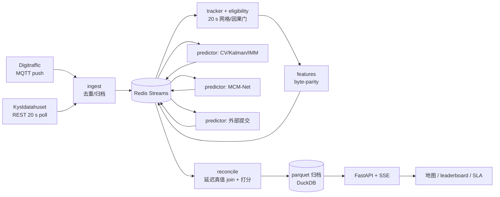
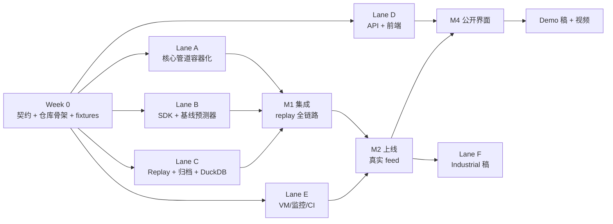

# AIS 在线预测平台 · 技术路线图

Sep 24, 2026 · @Mark

## 1. 目标、约束与假设

把现有的单机七进程服务改造成一个**自评分的开放在线预测平台**：共享 AIS 流管道，预测器以插件形式 shadow 并行运行，延迟真值统一打分，产出 live leaderboard、公开地图界面和持续增长的带真值数据集。三个目标由同一套系统满足：SIGMOD 2027 Industrial（平台与 protocol）+ Demo（观众体验）两篇论文；长期真实运行；开源让外部研究者提交预测器。

| 硬约束 | 数值 / 内容 | 影响 |
| --- | --- | --- |
| Industrial 截止 | 2026-11-24 AoE，12 页 + 参考文献，单盲 | 平台须在 11 月初上线并积累 ≥3 周新数据 |
| Demo 截止 | 2027-01-11，4 页，可附 5 min 视频 | 地图前端与公开 URL 须在 12 月底可用 |
| 非学术合著者 | Industrial 硬门槛，截止后不可改作者 | 10 月底前落实（Fintraffic / Kystverket / 航运企业） |
| 现有服务形态 | 单机 15 GB CPU，7 个 supervised 进程，文件队列，SQLite 指标库，zstd-parquet 归档 | 改造而非重写；管道逻辑原样迁移 |
| 负载 | Finland ≈152k msg/h + Norway ≈4,000 pos/20 s；≈69k 预测/天；单 worker 利用率 0.25 | 单机足够，不引入 Kafka/Flink |
| 数据许可 | Digitraffic CC BY 4.0，Kystdatahuset NLOD，OSM ODbL | 可再发布归档与预测记录 |

**假设**（与实际不符时在评论里指出，我改计划）：现有代码是 Python；开发人力 2–4 人，可并行 3–4 条泳道；GPU 训练与 memory bank 导出留在离线侧，平台只消费导出的 artifact；MCM-Net 代码是否首批开源取决于 KBS 稿进度，平台设计不依赖这一决定。

## 2. 目标架构

一台云 VM 上的 docker compose 栈：管道服务通过 Redis Streams 传递消息，预测器是订阅同一个 `windows.eligible` 主题的独立容器，reconciler 对所有预测器用同一套 serving-eligibility protocol 打分，归档落到 parquet 由 DuckDB 直查，API 以 SSE 推送给静态前端。



读法：左侧两个 feed 进入同一个 ingest；中间所有预测器对等地订阅窗口、发布候选；reconcile 在真值到达（10 min 后）时统一打分，它是平台唯一的“裁判”。

| 服务 | 职责 | 来源 | 副本 |
| --- | --- | --- | --- |
| ingest-fi / ingest-no | 订阅/轮询、去重、MMSI 黑名单、原始归档（按小时 zstd-parquet）、发布 `ais.raw` | 现有 ingest 拆为每 feed 一个 | 1 |
| tracker | 每船状态、causal 20 s 网格重采样、三分法 eligibility、发布 `windows.eligible` | 现有 tracker | 1（状态在 Redis） |
| features | 特征向量与环境栅格（预建 OSM tile），parity 校验 | 现有 features | 1–2 |
| predictor-\* | 订阅窗口，输出 K 候选 + 可选分数，发布 `predictions.<id>` | 现有 predict 拆为插件 | 每预测器 1–N |
| reconcile | 真值到达后对每个预测器打分，写 `scores` parquet | 现有 reconcile | 1 |
| jobs | 夜间 memory refresh、每日 parquet 发布到 HF、leaderboard 聚合、drift 检查 | 现有 metrics 重组 | 1 |
| api | REST + SSE：实时船位/候选/真值、leaderboard、SLA、DuckDB 查询 | 新建 | 1–2 |
| web | 静态前端 | 新建 | CDN |
| caddy / prometheus / grafana / loki | TLS、指标、面板、日志 | 新建 | 1 |

两条设计不变量：CPU-only（第二个 predictor 副本即可把 P99 服务延迟从 61 s 压到 ≈20 s）；train–serve byte-parity（features 服务启动时对 golden 样本自检，不过则拒绝启动）。

## 3. 技术栈选型

选型原则：单机可跑、零专职运维、研究者笔记本能复现、每个组件都能在论文里用一句话说清为什么选它。推荐项加粗。

### 3.1 运行时与工程化

| 决策点 | 候选 | 分析 | 推荐 |
| --- | --- | --- | --- |
| 语言 | Python 3.11 / Rust 重写热路径 / Go | 现有代码是 Python；计算只占服务延迟 2.9%，重写无收益；研究者提交预测器几乎全是 Python | **Python 3.11**，预测器协议语言无关 |
| 包管理 | pip+venv / poetry / pdm / uv | uv 解析快一个量级、lockfile 确定、Dockerfile 一行安装；poetry 慢且 lock 常冲突 | **uv** + `pyproject.toml` workspace（core / sdk / predictors 各一个包） |
| 代码质量 | ruff / black+isort+flake8 / pylint | ruff 一个工具覆盖 lint+format，毫秒级 | **ruff** + **pyright**（basic 模式）+ pre-commit |
| 配置 | argparse / YAML+dict / hydra / pydantic-settings | 需要环境变量覆盖、类型校验、和消息 schema 同一套工具；hydra 面向实验而非服务 | **pydantic-settings** + YAML，冻结的 preprocessing 配置随 artifact 发布 |
| 测试 | pytest / unittest | replay 驱动的 golden 测试是核心：parity 测试重用现有 ≤10⁻¹² m 校验 | **pytest** + hypothesis（eligibility 门的性质测试） |
| 文档 | MkDocs Material / Sphinx / Docusaurus | 研究者受众，Markdown 优先，自带搜索和 API 页 | **MkDocs Material** + mkdocstrings，GitHub Pages 托管 |
| 许可 | MIT / Apache-2.0 / AGPL | Apache-2.0 带专利授权，产业合作方能用；AGPL 会阻止海事企业采用 | **Apache-2.0** 代码，**CC BY 4.0** 数据与权重 |

### 3.2 流处理与存储

| 决策点 | 候选 | 分析 | 推荐 |
| --- | --- | --- | --- |
| 进程间消息 | 文件队列（现状）/ ZeroMQ / Redis Streams / NATS JetStream / RabbitMQ / Kafka / Redpanda | 需要：多消费者广播（N 个预测器订同一窗口）、consumer group（predictor 副本分流）、短期持久（重启不丢）、语言无关客户端。文件队列不支持广播；ZeroMQ 无持久；Kafka/Redpanda 在 150k msg/h 下是纯运维负担（JVM、分区、多一个常驻服务）；NATS 优秀但多一个组件；Redis 同时充当 tracker 共享状态和 API 缓存 | **Redis Streams**（consumer groups + `MAXLEN` 修剪），一个容器解决消息、状态、缓存三件事 |
| 消息序列化 | JSON / msgpack / protobuf / Arrow IPC / pickle | 窗口载荷含 30×8 数值序列 + 8×128×128 栅格（float16 ≈262 KB）；JSON 体积大且丢精度；protobuf 需编译步骤；pickle 不跨语言且不安全（外部预测器） | **msgpack** 控制字段 + **Arrow IPC** 二进制数组，schema 用 pydantic 定义并导出 JSON Schema 供非 Python 预测器 |
| 栅格传递 | 随消息内联 / 共享卷按 tile id 引用 / 预测器自行栅格化 | 内联最简单但流量×N 预测器；自行栅格化破坏 parity | **共享只读卷里的预建 OSM tile，消息只带 tile id + 偏移**，SDK 负责读取 |
| 在线状态 | 进程内字典（现状）/ Redis hash / SQLite | tracker 单副本时进程内可行，但重启丢失 45 min 历史尾；Redis 已在栈里 | **Redis hash per MMSI**，TTL 2 h，重启后即刻可用 |
| 归档格式 | CSV / JSONL / parquet zstd（现状）/ Lance / Iceberg | parquet 已是现状，DuckDB/pandas/polars/HF 全支持；Iceberg 多一层 catalog，单机无意义 | **parquet + zstd**，Hive 分区 `feed=/date=/hour=`，原子 rename 写入保留 |
| 分析查询 | SQLite（现状）/ DuckDB / ClickHouse / TimescaleDB / Postgres / polars | SQLite 对千万行聚合慢且不读 parquet；ClickHouse/Timescale 是常驻服务，引入运维；DuckDB 直接 `read_parquet('**/*.parquet')`，嵌入式，研究者本地同一句 SQL 可复现，SIGMOD 审稿人熟悉 | **DuckDB**；API 进程内嵌入，jobs 每小时物化 leaderboard/SLA 聚合表 |
| 关系元数据 | SQLite / Postgres / 无 | 预测器注册表、提交记录、榜单收录状态量小；Postgres 又多一个容器 | **SQLite（WAL）**，仅存元数据；外部提交过百时再考虑 Postgres |
| 定时任务 | cron in container / APScheduler / Prefect / Airflow / Dagster | 只有 ≤5 个任务（夜间 refresh、每日发布、小时聚合、drift、归档压缩）；Airflow/Prefect 是平台级依赖 | **jobs 服务 + APScheduler**，每个任务也能 `python -m jobs.<name>` 手动跑 |

### 3.3 预测器插件机制

| 决策点 | 候选 | 分析 | 推荐 |
| --- | --- | --- | --- |
| 接入形态 | 进程内 Python entry-point / 子进程 stdin-stdout / 独立容器订阅 broker / gRPC 服务 / HTTP 服务 | 进程内最快但一个崩溃拖垃全站且依赖冲突；gRPC/HTTP 需要平台主动调用，外部预测器需要开端口；容器订阅 broker 天然隔离、语言无关、能限 CPU/内存、研究者只交一个 Dockerfile | **独立容器订阅 Redis Streams**；SDK 同时提供进程内模式供本地开发与 replay |
| SDK 接口 | 自由函数 / ABC 基类 / Protocol | 需要类型检查和最小义务 | `class Predictor(Protocol): def predict(self, window: Window) -> Candidates`，另有 `warmup()` 和 `info()` |
| 资源限制 | 无 / compose `deploy.resources` / cgroup 手工 | 外部预测器可能失控 | compose 限 CPU 2 核 / 4 GB，超时 5 s 未返回记为 miss（计入 coverage） |
| 模型权重分发 | git LFS / HF Hub / S3 / 镜像内置 | HF 已托管 EnvShip，有版本、有 CDN | **HF Hub**，容器启动时按 revision 拉取并校验 sha256 |
| 外部提交流程 | 自动拉镜像 / PR + CI + 人工白名单 | 安全：不能跑未审查镜像 | **PR 到 `predictors/`，CI 跑 replay 1 小时 + parity，维护者合并后 GHCR 自动构建，维护者手动上线** |

### 3.4 API 与前端

| 决策点 | 候选 | 分析 | 推荐 |
| --- | --- | --- | --- |
| 后端框架 | FastAPI / Litestar / Flask / Django / Node (Fastify) | 需要 async、SSE、和 SDK 共用 pydantic 模型、自动 OpenAPI；Flask 无原生 async；Django 过重；Litestar 更快但生态小 | **FastAPI** + uvicorn，2 worker |
| 实时推送 | 轮询 / SSE / WebSocket / MQTT over WS | 单向、自动重连、经过 Caddy 无需特殊配置；WebSocket 只在需要客户端上行时才值得 | **SSE**（`/stream/positions`、`/stream/scores`），每 5 s 一帧差分 |
| 前端框架 | React+Vite+TS / Vue 3 / Svelte 5 / SolidJS / 纯 JS | deck.gl 与 MapLibre 的 React 绑定最成熟；外部贡献者 React 最多 | **React 18 + Vite + TypeScript** |
| 地图引擎 | MapLibre GL JS / Leaflet / Mapbox GL / OpenLayers / CesiumJS | Leaflet 对 ≥千船 + 20 候选扇面的 canvas 渲染吃力；Mapbox 收费且 token 绑定；Cesium 3D 无必要；MapLibre 开源、WebGL、与 deck.gl 集成 | **MapLibre GL JS + deck.gl**（ScatterplotLayer 船位、PathLayer 候选/真值） |
| 底图矢量瓦 | OpenFreeMap / Protomaps PMTiles 自托管 / MapTiler / Stadia | 长期运行不能依赖免费 SaaS 配额；PMTiles 单文件（北欧 ≈ 2 GB）放 Caddy 直接 range 请求 | **OpenFreeMap 起步，Protomaps PMTiles 自托管作为 v1.0 默认**，叠加 OpenSeaMap 海图层 |
| 图表 | ECharts / Plotly.js / Recharts / uPlot / Observable Plot | leaderboard 时序、SLA CDF、drift 带；ECharts 对大时序和双主题成熟，Apache 许可；Plotly 体积 3 MB+ | **ECharts** |
| 前端托管 | 同机 Caddy 静态 / GitHub Pages / Cloudflare Pages / Vercel | 静态站与 API 分离让 VM 重启不影响页面；GitHub Pages 无自定义 header；Cloudflare 在中国大陆访问不稳 | **Caddy 同机静态为主**（最少依赖），GitHub Pages 作镜像 |

### 3.5 基础设施与运维

| 决策点 | 候选 | 分析 | 推荐 |
| --- | --- | --- | --- |
| 主机 | Hetzner / OVH / Scaleway / DigitalOcean / AWS / 阿里云 / 校内 VM | 需要公网 IP、长期实验室控制、靠近 feed（芬兰/挪威）；Hetzner CX42（8 vCPU / 16 GB / 160 GB）约 €25/月，德国/芬兰机房；AWS 同规格 4–5× 价格；校内 VM 防火墙与人员流动风险 | **Hetzner 赫尔辛基机房**，外挂 100 GB volume 存归档，VM 快照每周 |
| 编排 | docker compose / k3s / Nomad / systemd 裸进程 | 单机、≤ 15 容器；k3s 为未来多机预留但当前是纯成本 | **docker compose v2**，`profiles` 区分 live / replay / dev |
| 反向代理 + TLS | Caddy / nginx + certbot / Traefik | Caddy 自动证书、一个 Caddyfile、支持 SSE 与 range | **Caddy 2** |
| 指标 | Prometheus + Grafana / VictoriaMetrics / Datadog / 自建 | 标准、免费、每个 Python 服务 `prometheus_client` 一行暴露 | **Prometheus + Grafana**，个人面板直接复现论文 Figure 2–6 |
| 日志 | docker logs / Loki + Promtail / ELK | ELK 过重；Loki 与 Grafana 同屏 | **Loki**，保留 30 天 |
| 告警 | Alertmanager → Telegram / 邮件 / Slack | feed 断线、队列积压、parity 失败、磁盘 | **Alertmanager → Telegram bot + 邮件** |
| CI/CD | GitHub Actions / GitLab CI / Jenkins | 开源在 GitHub，GHCR 免费 | **GitHub Actions**：测试 → 构建镜像 → push GHCR → VM 上 Watchtower 或 SSH `compose pull && up` |
| 备份 | VM 快照 / restic 到 B2 / rsync 到实验室 NFS | 归档本身每日发布到 HF 已是异地副本 | **restic → Backblaze B2** 每日，另每周 rsync 到实验室 NFS |
| 数据发布 | HF datasets / Zenodo / S3 公开桶 | HF 支持滑动更新，Zenodo 给冻结版 DOI | **HF 每日追加** + **Zenodo 每季度冻结快照** |

不选的东西及理由，写进论文的 design decisions：Kafka/Flink（负载不需要，运维杀死长期运行）、Kubernetes（单机）、GPU 推理（计算占延迟 2.9%）、商业地图 SaaS（长期依赖）、Postgres/ClickHouse（DuckDB 足够且嵌入式）。

## 4. 接口契约（Week 0 冻结）

并行开发的前提是第一周就把下面四类契约写成 `contracts/` 包（pydantic 模型 + JSON Schema + parquet schema + OpenAPI）并合并到 main；之后每条泳道只依赖契约和 fixtures，不依赖彼此的实现。契约改动走 PR + 全体 review，版本号进消息头。

### 4.1 Redis Streams 主题

| 主题 | 生产者 | 消费者 | 载荷要点 | 保留 |
| --- | --- | --- | --- | --- |
| `ais.raw.{fi,no}` | ingest | tracker, 归档 | MMSI、接收时刻、发送时刻、lat/lon/SOG/COG、class、来源 feed | 1 h |
| `windows.eligible` | tracker + features | 所有 predictor（各自 consumer group） | window\_id、MMSI、anchor 时刻、30×8 AIS token（Arrow）、tile id + 偏移、e∈R¹⁹、eligibility tags、protocol\_version | 30 min |
| `predictions.{predictor_id}` | 每个 predictor | reconcile, api | window\_id、K×T\_f×2 候选（Arrow）、可选 K 个分数、选定候选下标、推理耗时、model\_revision | 30 min |
| `truth.realized` | tracker | reconcile | window\_id、真实未来 30 步、覆盖率、回填方式 | 30 min |
| `scores` | reconcile | api, jobs | window\_id、predictor\_id、ADE/FDE、per-horizon 误差、是否 benchmark-comparable、stratum（class/scene/feed） | 1 h |
| `sys.health` | 每个服务 | api, prometheus exporter | 队列深度、最近处理时刻、parity 状态 | 10 min |

命名与现稿一致：anchor、enqueue、issue 三个时钟字段在每条 `predictions` 消息里必带，SLA 分析不需要联表。

### 4.2 Predictor 接口

```python
class Window(BaseModel):
    window_id: str
    mmsi: int
    feed: str
    anchor_ts: datetime
    tokens: NDArray[float32]  # (30, 8): x, y, s, c, sin c, cos c, u(one-hot 8)
    abs_xy: NDArray[float64]  # (30, 2) 绝对坐标
    tile_id: str
    tile_offset: tuple[int, int]
    geom: NDArray[float32]  # (19,)
    tags: list[str]
    protocol_version: str


class Candidates(BaseModel):
    window_id: str
    predictor_id: str
    model_revision: str
    paths: NDArray[float32]  # (K, 30, 2) 相对 anchor 的位移
    scores: NDArray[float32] | None  # (K,) 越大越好，可缺
    selected: int  # served 候选下标
    compute_ms: float


class Predictor(Protocol):
    def info(self) -> PredictorInfo: ...  # id, version, K, 需要的 tags, CPU/内存需求
    def warmup(self, tiles: TileStore) -> None: ...
    def predict(self, w: Window) -> Candidates: ...
```

平台打分两个量：`selected` 候选的 ADE（served 指标，榜单主列）与 best-of-K ADE（oracle，只作参考列）。不返回 `scores` 的预测器 `selected` 必须给出。容器协议：启动时读环境变量 `REDIS_URL`、`PREDICTOR_ID`、`TILE_DIR`，SDK 的 `run_predictor(MyPredictor())` 封装订阅/发布/心跳/超时。

### 4.3 Parquet 表

| 表 | 分区 | 主键 | 用途 |
| --- | --- | --- | --- |
| `raw_ais` | feed / date / hour | (mmsi, recv\_ts) | 原始归档，replay 数据源，HF 发布 |
| `windows` | date / hour | window\_id | 已发布的 eligible 窗口（含 tags） |
| `predictions` | predictor\_id / date | (window\_id, predictor\_id) | 候选与三个时钟 |
| `truth` | date | window\_id | 实现的未来与覆盖率 |
| `scores` | predictor\_id / date | (window\_id, predictor\_id) | ADE/FDE/per-horizon/stratum |
| `leaderboard_hourly` | date | (predictor\_id, hour) | jobs 物化，API 直读 |
| `sla_hourly` | date | (feed, hour) | freshness/service 分位数，对应现稿 Table 4/5 |

### 4.4 API

| 端点 | 类型 | 内容 |
| --- | --- | --- |
| `GET /v1/leaderboard?window=7d&stratum=all` | REST | 每预测器 served ADE、best-of-K、coverage、n、引导自助 95% CI |
| `GET /v1/vessels/{mmsi}/latest` | REST | 历史 30 步、各预测器候选、已到达的真值 |
| `GET /v1/sla?feed=fi&window=24h` | REST | freshness / service 分位数与达标率 |
| `GET /v1/query` | REST (POST SQL, 只读) | DuckDB 只读视图，限时 10 s，限行 10k |
| `GET /stream/positions` | SSE | 每 5 s 一帧：新船位、新窗口、新候选、新真值 |
| `GET /stream/scores` | SSE | 每次 reconcile 产出一条 |
| `GET /v1/predictors` | REST | 注册表、版本、上线时间、榜单收录状态 |
| `GET /metrics` | Prometheus | 每服务各自暴露 |

## 5. Pipeline 开发模式与并行泳道

六条泳道在 Week 0 契约冻结后同时开工，每条泳道用契约里的 fixtures（一小时归档、十个窗口、一组候选）独立测试，只在里程碑点做集成。平台开发本身也是一条流水线：任何一条泳道的产出合并后，CI 用 replay 跑完整链路一小时，绿了才发布镜像。



读法：A/B/C 三条在 M1 首次汇合，D 可以一直用 fixtures 和 mock SSE 开发到 M2 之后才接真数据，E 与代码无依赖。

| 泳道 | 交付物 | 依赖 | 解耦手段 | 人力 |
| --- | --- | --- | --- | --- |
| **A 核心管道** | ingest-fi/no、tracker、features、reconcile、jobs 五个容化服务；文件队列→Redis Streams；tracker 状态→Redis；parity 自检启动门 | 契约 4.1/4.3 | 用 fixtures 里的 raw 小时文件做单测；不等 predictor，用 SDK 里的 CV 做冒烟测试 | 1 人（最熟现有代码者） |
| **B SDK + 预测器** | `sdk` 包（Protocol、run\_predictor、TileStore、本地 replay 适配）；CV / Kalman / IMM / MCM-Net 四个容器；候选评分头 + mode-router 作为第五个 "routed" 预测器 | 契约 4.2 | fixtures 里的十个窗口；MCM-Net 从现有 predict worker 拆出，权重上 HF 私有仓 | 1 人 |
| **C Replay + 数据** | `replay` 服务（按归档以 1–100× 回放到 `ais.raw`）；parquet 写入器与分区；DuckDB 视图与物化任务；七月 20.9 天归档转换为新分区；HF 发布脚本 | 契约 4.3 | 纯离线，只需现有归档 | 1 人（可与 E 同一人） |
| **D API + 前端** | FastAPI 端点与 SSE；React 地图页、leaderboard 页、SLA 页、predictor 详情页；mock 服务器 | 契约 4.4 | OpenAPI 生成 TS 类型；mock SSE 从 fixtures 回放，前端全程不需要后端 | 1 人（前端可交给硕士生） |
| **E 基础设施** | VM、域名、Caddy、compose profiles、Prometheus/Grafana/Loki/Alertmanager、GitHub Actions、GHCR、restic 备份、PMTiles | 无 | 先用 `hello` 容器把全链路打通，再换真镜像 | 0.5 人 |
| **F 论文** | Industrial 稿改写（平台 + protocol 叙事）、Demo 稿、视频、CONTRIBUTING/榜单规则 | M2 后的新数据 | 结构与系统章节可先写，数字最后填 | 你 |

工作方式：trunk-based，每泳道短分支 ≤ 3 天合入 main；PR 必须带测试，改契约必须全体 review；每周一次 30 min 集成会只看 CI 的 replay 报告。人少于 4 时合并顺序：C+E 同人，B+D 同人（先 B 后 D），A 独立。

## 6. 里程碑与逐周时间表

从今天（2026-09-24）到 Industrial 截止有 8.5 周，到 Demo 截止 15.5 周。关键路径是 **M2 上线日 11-01**：它决定 Industrial 稿能报多少天新平台数据（目标 ≥ 3 周，即 ≥ 21 天 × ≈69k 预测/天）。

| 里程碑 | 日期 | 完成标志 |
| --- | --- | --- |
| M0 契约冻结 | 10-04 | `contracts/` 合并；fixtures 发布；仓库骨架、CI 绿；VM 与域名就绪 |
| M1 Replay 全链路 | 10-18 | 笔记本上 `compose --profile replay up` 回放 2026-07-25，五个预测器得分与现稿 Table 3 在重叠子集上一致（±0.5 m） |
| M2 真实 feed 上线 | 11-01 | 两国 feed 在 VM 运行，Grafana 面板、告警、备份就位；leaderboard API 可读 |
| M3 Industrial 提交 | 11-24 | 12 页稿，含 ≥ 3 周新数据、非学术合著者 |
| M4 公开界面 | 12-20 | 地图/leaderboard/SLA 三页上线，公开 URL，5 min 视频素材录完 |
| M5 Demo 提交 | 2027-01-11 | 4 页稿 + 视频 |
| M6 开源 v1.0 | 2027-02-28 | 仓库公开，CONTRIBUTING、榜单规则、HF 每日发布运行，首个外部预测器接入演练 |

| 周 | 日期 | Lane A 管道 | Lane B SDK/预测器 | Lane C Replay/数据 | Lane D API/前端 | Lane E 基础设施 | Lane F 论文 |
| --- | --- | --- | --- | --- | --- | --- | --- |
| 0 | 09-24–10-04 | 共同：契约、fixtures、仓库骨架、uv workspace | 同左 | 同左 | OpenAPI → TS 类型，mock 服务器 | 购 VM、域名、Caddy、compose 骨架、CI 模板 | 联系产业合著者；Industrial 稿大纲 |
| 1 | 10-05–10-11 | ingest-fi/no 容化 + Redis 发布 | SDK 核心 + CV/Kalman 容器 | replay 服务 + parquet 写入器 | 地图页（mock 数据） | Prometheus/Grafana/Loki | 系统章节初稿 |
| 2 | 10-12–10-18 | tracker 状态迁 Redis，features parity 门，reconcile 多预测器打分 | IMM + MCM-Net 容器，routed 预测器 | DuckDB 视图，七月归档转分区 | leaderboard/SLA 页（mock） | Alertmanager、restic、GHCR 发布流 | protocol 章节（榜单收录规则） |
| 3 | 10-19–10-25 | **M1 集成**：修 bug，与 Table 3 对账 | 同左 | jobs：小时物化、夜间 refresh 迁移 | FastAPI 真实端点接 DuckDB | 预发环境 replay 跑 72 h 稳定性 | 实验章节框架 |
| 4 | 10-26–11-01 | **M2 上线**，守护一周 | 预测器资源限制、超时 miss 语义 | HF 发布脚本（先私有） | SSE 接真数据 | 上线对账、告警验证 | 引言/相关工作 |
| 5–6 | 11-02–11-15 | 运行 + 修复 | 运行 | 每日分析脚本（gap 分解、分层） | 前端打磨，predictor 详情页 | — | 实验章节填新数据，内部 review |
| 7–8 | 11-16–11-24 | 冻结 | 冻结 | 冻结数据快照 | — | — | **M3 提交** |
| 9–12 | 11-25–12-20 | 第二 predictor 副本，P99 优化 | 外部提交流程演练 | HF 公开发布 | **M4**：公开 URL、双主题、移动端、视频录制 | PMTiles 自托管 | Demo 稿初稿 |
| 13–15 | 12-21–01-11 | — | — | — | 修改 | — | **M5 提交** |
| 16–22 | 01-12–02-28 | 根据 Industrial 审稿意见（01-26）补实验 | — | Zenodo 快照 | — | — | 修改稿（02-23）；**M6 开源** |

## 7. 各泳道完成定义与验收

验收全部是可自动执行的命令或可读的面板，不接受“在我机器上能跑”。

| 泳道 | 完成定义 | 验收方式 |
| --- | --- | --- |
| A 核心管道 | 五个服务各自镜像；kill -9 任一服务后 30 s 内自恢复且无重复/丢失窗口；features 启动 parity 校验 ≤ 10⁻¹² m；reconcile 对 N 个预测器独立打分 | `pytest tests/pipeline` + replay 1 h 后 `windows` 与 `truth` 行数对账脚本 |
| B SDK/预测器 | `pip install envship-sdk` 后 30 行写出一个预测器；五个内置预测器在 replay 2026-07-25 上的 served ADE 与 Table 3 重叠子集差 ≤ 0.5 m；超时/崩溃预测器不影响其他预测器 | `sdk/examples/minimal.py` 文档测试；`tests/regression/table3.py` |
| C Replay/数据 | 任一历史日可以 1–100× 回放；DuckDB 一句 SQL 复现 Table 3、4、5、7；HF 每日发布幂等 | `notebooks/reproduce_tables.ipynb` 在 CI 跑通 |
| D API/前端 | Lighthouse 性能 ≥ 80；千船 + 5 预测器 × 20 候选渲染 ≥ 30 fps；SSE 断线重连不丢帧；双主题；手机宽度可用 | Playwright e2e 对 mock 服务器；人工看一次真环境 |
| E 基础设施 | `git push main` → 20 min 内新镜像在 VM 运行；feed 断 5 min 触发告警；备份可恢复演练一次；VM 重启后全栈自启 | 一次故意断网 + 一次故意重启的记录 |
| F 论文 | Industrial 稿每个数字可由 `notebooks/` 重新生成；作者名单包含非学术单位；Demo 稿描述的每个交互在公开 URL 上可操作 | 内部 review 按你的 A–E 格式 |

## 8. 风险与对策

| 风险 | 可能性 | 影响 | 对策 |
| --- | --- | --- | --- |
| 11 月前找不到非学术合著者 | 中 | Industrial 无法提交 | Week 0 就发邂邀，目标三家（Fintraffic、Kystverket、一家航运/引航公司）；备选：同一稿改投 KDD 2027 ADS 或 VLDB 2027 Industrial（affiliation 要求待核实），Demo 照投 |
| M2 延期到 11 月中 | 中 | 新数据不足 3 周 | 论文主结果仍用七月 20.9 天，新平台数据作为“同一 protocol 第二窗口”报 ≥ 10 天；不推迟 M3 |
| Norway TCP feed 仍不可用 | 高 | 轮询新鲜度 74.7 s 中位数不变 | 保持轮询，论文里作为 push vs poll 对照；向 Kystverket 申请 TCP 接入作为合作切入点 |
| 外部预测器耗尽资源 | 中 | 平台卡死 | compose 限 CPU/内存、超时 5 s 记 miss、榜单要求 coverage ≥ 95%；外部预测器只在维护者手动上线 |
| KBS 稿与开源时机冲突 | 中 | MCM-Net 代码不能首批公开 | 平台 v1.0 先开源 CV/Kalman/IMM/routed，MCM-Net 容器以私有镜像运行，榜单照显示；KBS 录用后公开 |
| 中国大陆访问 HF/公开 URL 不稳 | 高 | 国内合作者和学校展示受影响 | 前端与数据不依赖 Cloudflare；提供魔搭/校内 NFS 镜像 |
| VM 单点故障 | 低 | 数小时中断 | 每周快照 + restic 每日；中断本身是论文里的 availability 数字，如实报告 |
| 长期运行无人维护 | 中 | 平台在你毕业后停止 | 所有运维入口写在 `docs/runbook.md`；VM 账号和域名由实验室而非个人持有；硕士生从 Lane D 进入后接手 Lane E |
